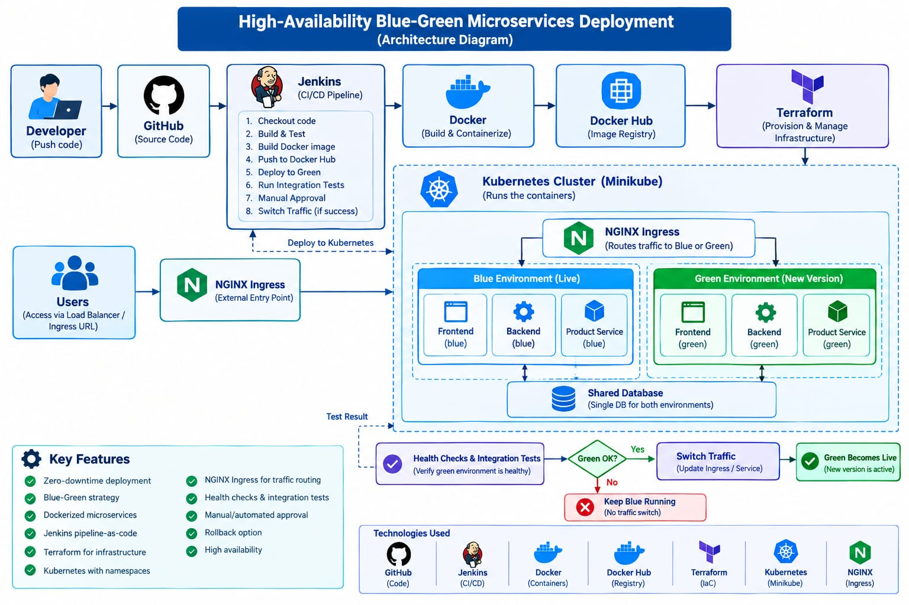
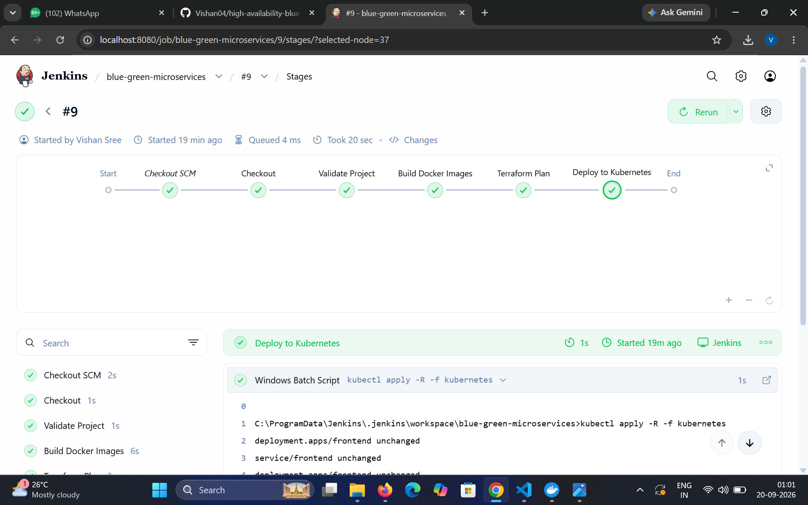

High-Availability Blue-Green Microservices Deployment Platform

A DevOps-based microservices deployment platform implementing Blue-Green Deployment, CI/CD automation, Docker containerization, Kubernetes orchestration, Terraform Infrastructure as Code, and NGINX traffic routing.

---

📌 Overview

This project demonstrates a production-inspired approach for deploying new application versions with minimal service interruption.

Two independent environments are maintained:

- 🔵 Blue — Current stable version
- 🟢 Green — New version under validation

The new version is deployed to Green while Blue continues serving traffic. After successful validation, traffic can be switched to Green. If an issue occurs, traffic can be rolled back to Blue.

The deployment workflow is automated using Jenkins, while Kubernetes infrastructure is managed using Terraform.

---

🏗️ Architecture

                         Developer
                             │
                             ▼
                          GitHub
                             │
                             ▼
                          Jenkins
                             │
              ┌──────────────┼──────────────┐
              │              │              │
              ▼              ▼              ▼
          Checkout       Docker Build   Terraform Plan
              │              │              │
              └──────────────┼──────────────┘
                             │
                             ▼
                    Kubernetes / Minikube
                             │
              ┌──────────────┴──────────────┐
              │                             │
              ▼                             ▼
       🔵 BLUE ENVIRONMENT           🟢 GREEN ENVIRONMENT
             v1                             v2
              │                             │
              └──────────────┬──────────────┘
                             │
                             ▼
                      Traffic Router
                             │
                             ▼
                       NGINX Ingress
                             │
                             ▼
                           Users

Architecture Screenshot

---

🛠️ Technology Stack

Technology| Purpose
Python / Flask| Microservices
Docker| Containerization
Docker Compose| Local development
Kubernetes| Container orchestration
Minikube| Local Kubernetes cluster
NGINX Ingress| Traffic routing
Terraform| Infrastructure as Code
Jenkins| CI/CD automation
Git / GitHub| Version control
PowerShell| Command-line operations

---

🔹 Microservices

Frontend Service

- Built using Flask
- Runs on port "5000"
- Provides application information
- Communicates with the Product Service
- Includes a health endpoint

Product Service

- Built using Flask
- Runs on port "5001"
- Provides product information
- Includes a health endpoint

Frontend
    │
    │ HTTP
    ▼
Product Service

---

🐳 Docker

Each microservice is packaged as an independent Docker image.

Build Frontend

docker build -t blue-green-frontend:v2 ./frontend

Build Product Service

docker build -t blue-green-product-service:v2 ./product-service

Run Locally

docker compose up --build

---

☸️ Kubernetes

The application is deployed on a Kubernetes cluster using Minikube.

Kubernetes Cluster
│
├── blue
│   ├── Frontend
│   └── Product Service
│
├── green
│   ├── Frontend
│   └── Product Service
│
└── routing
    ├── Traffic Router
    ├── NGINX Configuration
    └── Ingress

Multiple replicas are used for the application deployments.

---

🔄 Blue-Green Deployment

Blue Environment

Blue represents the stable application version.

Frontend        → v1
Product Service → v1

Green Environment

Green represents the new application version.

Frontend        → v2
Product Service → v2

Deployment Flow

Blue v1
   │
   │ New version deployed
   ▼
Green v2
   │
   │ Validation
   ▼
Traffic Switch
   │
   ▼
Green v2 → Live

Rollback

If the new version has an issue:

Green v2
   │
   │ Rollback
   ▼
Blue v1 → Live

This allows the previous stable version to remain available for quick recovery.

---

🌐 NGINX Traffic Routing

NGINX is used as the traffic-routing layer.

Users
  │
  ▼
NGINX Ingress
  │
  ▼
Traffic Router
  │
  ├──────────► Blue
  │
  └──────────► Green

Traffic can be switched between the Blue and Green environments.

---

🏗️ Terraform

Terraform is used to define Kubernetes infrastructure as code.

The Terraform configuration manages core resources including:

- Kubernetes namespaces
- Blue frontend deployment
- Green frontend deployment
- Blue product-service deployment
- Green product-service deployment
- Kubernetes services

Terraform Commands

cd terraform
terraform init
terraform validate
terraform plan

Infrastructure configuration can therefore be maintained through version control.

---

🔄 Jenkins CI/CD

Jenkins automates the deployment workflow.

Pipeline

GitHub
   ↓
Checkout
   ↓
Validate Project
   ↓
Build Docker Images
   ↓
Terraform Init
   ↓
Terraform Plan
   ↓
Deploy to Kubernetes

The Kubernetes configuration is deployed recursively using:

kubectl apply -R -f kubernetes

---

✅ Jenkins Pipeline Success

The final Jenkins pipeline successfully executes the project workflow and deploys the Kubernetes resources.

Jenkins Success Screenshot

The pipeline includes:

- GitHub checkout
- Docker validation
- Kubernetes client validation
- Terraform validation
- Docker image builds
- Terraform initialization
- Terraform plan
- Kubernetes deployment

---

📂 Project Structure

blue-green-microservices/
│
├── frontend/
│   ├── app.py
│   ├── Dockerfile
│   └── requirements.txt
│
├── product-service/
│   ├── app.py
│   ├── Dockerfile
│   └── requirements.txt
│
├── kubernetes/
│   ├── blue/
│   ├── green/
│   └── traffic-router/
│
├── terraform/
│   └── main.tf
│
├── docker-compose.yml
├── Jenkinsfile
└── README.md

---

🔍 Verification Commands

Check Pods

kubectl get pods -A

Check Deployments

kubectl get deployments -A

Check Services

kubectl get services -A

Check Ingress

kubectl get ingress -A

---

🚀 Key Features

- Blue-Green deployment architecture
- Microservices architecture
- Docker containerization
- Docker Compose
- Kubernetes orchestration
- Minikube deployment
- NGINX Ingress
- Traffic routing
- Application rollback
- Multiple replicas
- Terraform Infrastructure as Code
- Jenkins CI/CD automation
- GitHub version control
- Automated Kubernetes deployment

---

📈 Project Outcome

This project demonstrates an end-to-end DevOps workflow:

Source Control
      ↓
CI/CD Automation
      ↓
Docker
      ↓
Terraform
      ↓
Kubernetes
      ↓
Blue-Green Deployment
      ↓
Traffic Routing
      ↓
Rollback

It provides practical experience with modern DevOps tools and demonstrates how containerized microservices can be deployed, managed, released, and rolled back using an automated deployment workflow.

---

💼 Skills Demonstrated

DevOps: CI/CD, deployment automation, release management

Containers: Docker, Docker Compose

Orchestration: Kubernetes, Minikube

Infrastructure as Code: Terraform

CI/CD: Jenkins

Networking: NGINX Ingress, Kubernetes Services

Version Control: Git, GitHub

Programming: Python, Flask

---

👨‍💻 Author

  Vishan Sree A

B.E. Computer Science and Engineering — 2026

Project Focus:
"DevOps" · "Docker" · "Kubernetes" · "Jenkins" · "Terraform" · "CI/CD" · "Microservices" · "Blue-Green Deployment"